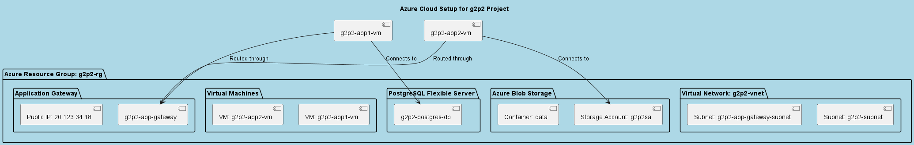

# Summary of Final Setup

## Azure Components

1. **Resource Group**:
   - **Purpose**: Logical container for all Azure resources to manage them as a single entity.
   - **Component**: `g2p2-rg`.

2. **Virtual Network (VNet)**:
   - **Purpose**: Provides isolated and secure communication between resources.
   - **Component**: `g2p2-vnet` with two subnets:
     - `g2p2-subnet`: Hosts VMs and private endpoints.
     - `g2p2-app-gateway-subnet`: Dedicated for the Application Gateway.

3. **PostgreSQL Flexible Server**:
   - **Purpose**: Managed database service for storing application data.
   - **Component**: `g2p2-postgres-db`.
   - **Security**: Private endpoint ensures secure access within the VNet.

4. **Azure Blob Storage**:
   - **Purpose**: Object storage for application data (reports).
   - **Component**: `g2p2sa` with a container named `data`.

5. **Virtual Machines (VMs)**:
   - **Purpose**: Hosts the Flask applications.
   - **Components**:
     - `g2p2-app1-vm`: Runs `app1` and connects to PostgreSQL.
     - `g2p2-app2-vm`: Runs `app2` and connects to Blob Storage.
   - **Security**: Network Security Groups (NSGs) restrict traffic to specific ports (SSH, HTTP, Flask app ports).

6. **Application Gateway**:
   - **Purpose**: Acts as a reverse proxy and load balancer for the applications.
   - **Component**: `g2p2-app-gateway`.
   - **Configuration**:
     - Frontend listens on port 80.
     - Routes traffic to backend pools for VMs on ports 5000 (app1) and 5001 (app2).

7. **Private Endpoint**:
   - **Purpose**: Securely connects the PostgreSQL server to the VNet without exposing it to the public internet.

8. **Public IP Address**:
   - **Purpose**: Provides external access to the Application Gateway.
   - **Component**: `g2p2-app-gateway-public-ip`.

## Diagram

This setup ensures secure, scalable, and efficient communication between resources while exposing only the necessary components to the public.